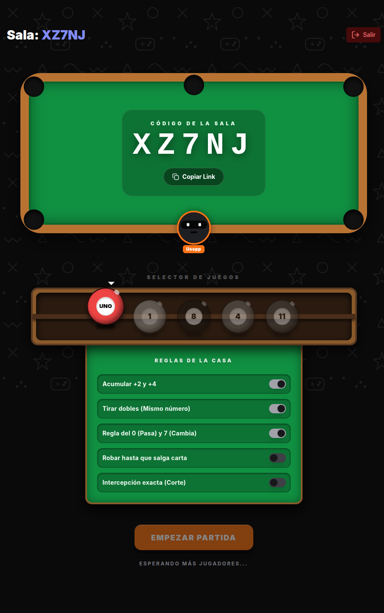
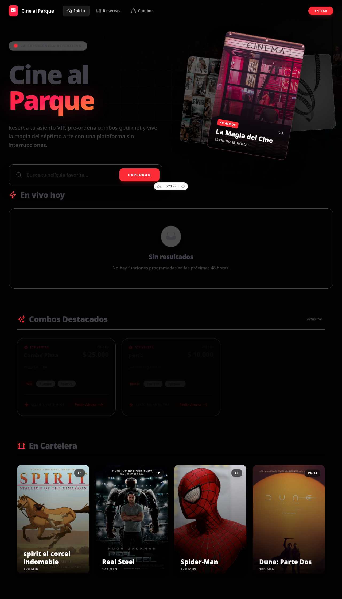

<div align="center">
  
  
  <p><em>Un hub de minijuegos multijugador en tiempo real diseñado para jugarse por Discord con cero fricción.</em></p>

  <p>
    
    
    
    
    
  </p>
</div>

---

## 📸 Capturas de Pantalla

<div align="center">
  
  
</div>

---

## 🚀 Inicio Rápido (Modo Desarrollo)

Este proyecto está dividido en dos partes que deben correr simultáneamente: el **Frontend** (Nuxt 3) y el **Backend** (Node.js/Socket.io). 

⚠️ **Regla estricta de la Tripulación:** Este proyecto usa `bun` exclusivamente. No uses `npm`.

### 1. Levantar el Backend (Motor de Juegos)
El servidor de WebSockets ahora se encuentra en su propio repositorio para mantener la arquitectura limpia.

> **Importante**: Asegúrate de haber clonado y configurado el backend por separado.

```bash
# Asumiendo que clonaste el backend en otra carpeta
cd ../discord-party-hub-backend
bun install
bun run dev
```
> El backend correrá en `http://localhost:3001`.

### 2. Levantar el Frontend (La Interfaz)
La interfaz de usuario interactiva y fluida.
```bash
# En la raíz del proyecto (discord-party-hub)
bun install
bun run dev
```
> El frontend correrá en `http://localhost:3000`.

---

## 🏛️ Arquitectura del Frontend (UI/UX)

La interfaz se rige por la estética **"Pro Max"** combinada con **"Flat 2D Vectorial"**.
- **Cliente 100% Puro:** El frontend de Nuxt no contiene base de datos, SSR APIs pesadas ni lógica de servidor interno. Toda la comunicación de red apunta exclusivamente al servidor Node.js/Express.
- **Colores:** Fondos ultra oscuros (`#0A0A0A`, `#151515`) contrastados con acentos de neón dinámicos (inyectados vía `--theme-color`).
- **Profundidad sin 3D:** Se evita el desenfoque (blur) y el fotorrealismo. Los volúmenes se logran con bordes gruesos de madera, sombras sólidas (ej. `shadow-[8px_8px_0px_#000]`) y paletas de colores planos.
- **Componentes Destacados:**
  - `PlayerTable.vue`: Una mesa de casino (`bg-[#991b1b]`) plana vista desde arriba. Identifica al creador de la mesa con una corona Flat 2D dorada.
  - `GameSelector.vue`: Un mueble de estantería de madera maciza. Los juegos descansan protegidos por una soga SVG.
  - `TableHistoryBar.vue`: Una pizarra rústica anclada al layout que muestra el *Leaderboard* en vivo.

---

## ⚙️ Arquitectura de Sincronización
- Nuxt UI consume el estado mediante `Pinia` (`playerStore.ts`, `unoStore.ts`).
- Las peticiones HTTP (Leaderboard, Update Profile) utilizan `$fetch` consumiendo el puerto de la API externa (Express).
- La conexión de WebSockets se gestiona en `composables/useSocket.ts` implementando un control bidireccional "Anti-Ping-Pong" para no sobrecargar el servidor en eventos reactivos (ej. Apagar switches).

---

## 📝 Reglas de Contribución (Luffy Crew)
1. **Atajos Prohibidos:** Nunca hacer commits directos a `main`. Usar ramas `feat/` o `fix/`.
2. **Refactorización Continua:** Componentes Vue limitados estrictamente a `< 150 líneas`. Si crecen, fragmentar.
3. **No `npm`:** Si haces `npm install`, te hacemos caminar por la tabla. Usa `bun`.
